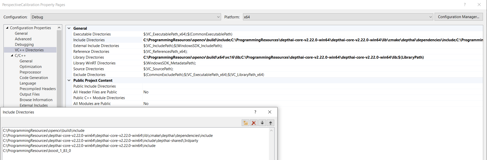
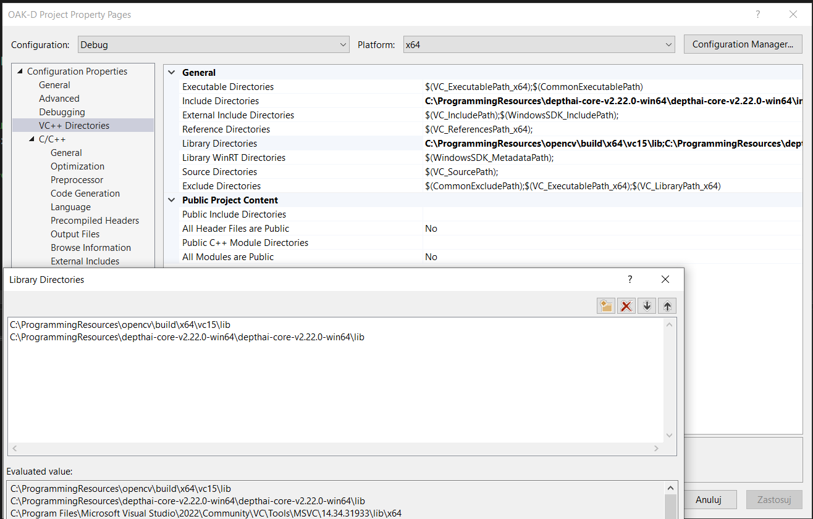
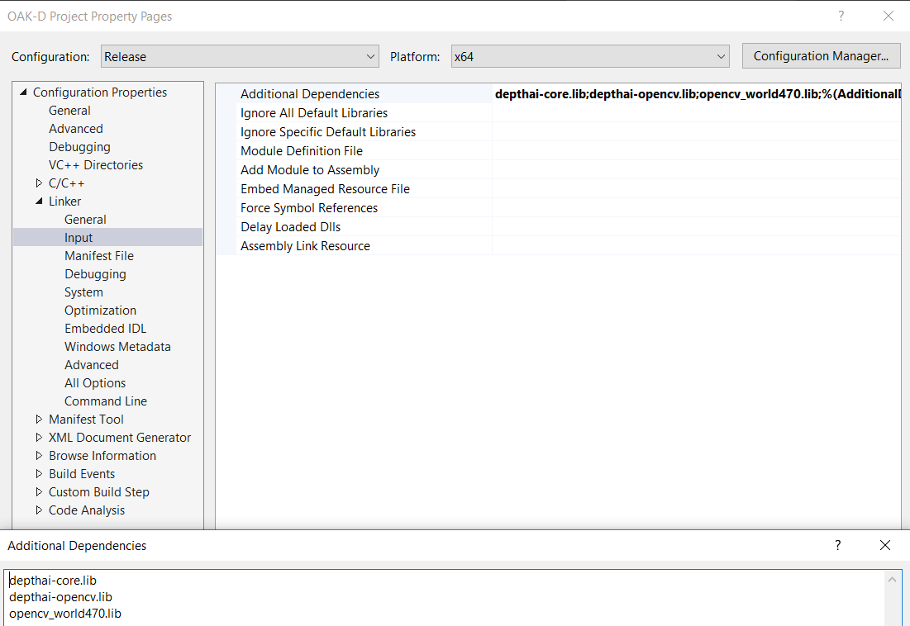

# StreamingOAK-Dcpp
This is a cpp version of the project that runs delta robot vision system

# This branch contains VisualStudio version of the project
In order to compile the project link precompiled depthai library like in following video:
https://www.youtube.com/watch?v=Fc0xm39cpKc

# Working project settings in VS

# Used dependencies
depthai-core: https://github.com/luxonis/depthai-core/releases/download/v2.22.0/depthai-core-v2.22.0-win64.zip\n
opencv: https://sourceforge.net/projects/opencvlibrary/files/4.7.0/opencv-4.7.0-windows.exe/download